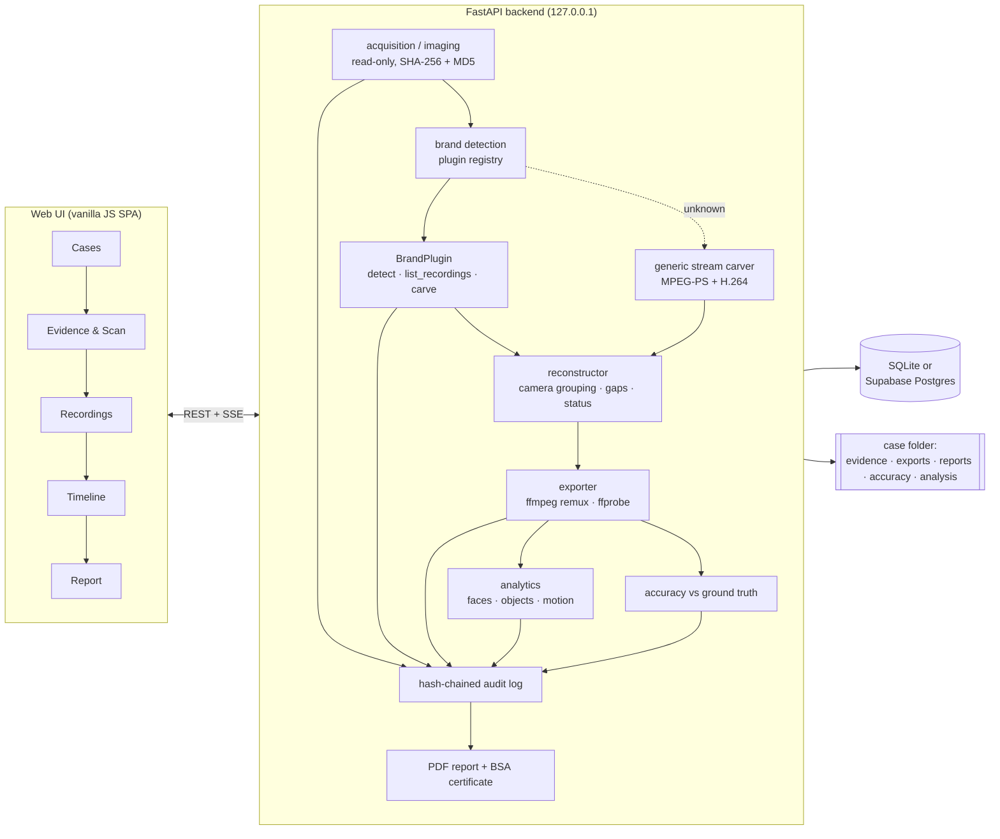

<div align="center">

# 🎥 DVR/NVR Forensic Analysis Tool

### One workflow for acquiring, recovering, validating and reporting surveillance evidence from many DVR/NVR vendors


</div>

---

> [!IMPORTANT]
> **Honest status.** Everything in this project has been tested against disk images **we generated ourselves** (from public
> specifications and real, ffmpeg-encoded video), never against a physical recorder disk. Two OEM formats are implemented from
> published sources (Dahua, Hikvision), one from a single research paper (Honeywell), one by assumption (CP Plus), and four have
> **no vendor-specific support** (TP-Link, Godrej, Uniview, Matrix). Every recovered video is labelled `UNCERTAIN` or `PARTIAL`, never
> `COMPLETE`, unless independently verified. The tool never states a recovery percentage without ground truth.
> Details: [Format Admission Gate](docs/format_verification.md) · [OEM comparison](docs/oem_comparison.md).

---

## 📑 Contents

[The problem](#-the-problem) · [What it does](#-what-it-does) · [Architecture](#-architecture) · [OEM support](#-oem-support--what-is-really-implemented) ·
[Recovery pipeline](#-recovery-pipeline) · [Proving it works](#-how-we-check-that-it-works) · [Analytics](#-analytics) ·
[Quick start](#-quick-start) · [Using the tool](#-using-the-tool) · [API](#-api-overview) · [Security](#-security) ·
[Repository map](#-repository-map) · [Problem-statement checklist](#-problem-statement-checklist) · [Limitations](#-known-limitations) · [Roadmap](#-roadmap)

---

## 🎯 The problem

DVR/NVR recorders from Dahua, Hikvision, CP Plus, Honeywell, TP-Link, Godrej, Uniview, Matrix and others each use their own
disk layout, index and frame container. Standard forensic tools see an unformatted disk. Investigators end up juggling vendor
tools, with inconsistent results, unclear timestamps, weak deleted-footage recovery and a fragile chain of custody.

This project is a **vendor-agnostic platform**: one workflow, pluggable per-vendor parsers, a generic standards-based fallback
for unknown recorders, and forensic bookkeeping (hashes, audit chain, report, legal certificate) that is the same for all of them.

## ✨ What it does

| | Capability | State |
|---|---|---|
| 🧲 | **Acquisition**: load a raw image (`.dd/.img/.raw/.bin`), upload it, or **create one from a drive** (read-only, hashed, re-verified) | ✅ files tested · ⚠️ physical drive untested |
| 🔐 | **Integrity**: SHA-256 + MD5 in one pass, re-hash after every scan, re-verify on demand | ✅ |
| 🧭 | **Brand identification**: signature scoring across 8 OEM plugins; unknown disks fall back to generic carving | ✅ signatures from public sources |
| 🧩 | **Parsing & carving**: Dahua DHFS 4.1 index + DHAV frames, Hikvision HIKBTREE index + H.264/PS blocks, Honeywell records, generic MPEG-PS/H.264 | ✅ synthetic disks · ⚠️ no real disks |
| ♻️ | **Deleted footage**: carves regions the index no longer lists (e.g. after initialisation) | ✅ synthetic |
| 🎞️ | **Export**: lossless FFmpeg stream copy to MP4, `ffprobe` decode validation | ✅ |
| 🕒 | **Timeline & correlation**: per-camera timeline, cross-camera events, examiner-set clock offset to UTC | ✅ |
| 🙂 | **Face detection & search**: YuNet detector + SFace embeddings, reference-photo search | ✅ |
| 🧍 | **Object detection**: YOLOX (80 COCO classes) with a classical fallback | ✅ 3 real photos · ⚠️ no CCTV data |
| 🌀 | **Motion detection**: frame differencing, labelled as *basic*, never as AI | ✅ |
| 📏 | **Accuracy against ground truth**: frame recall / precision / order, byte placement, log coverage | ✅ new, honest "not measured" otherwise |
| ⛓️ | **Hash-chained audit log** of every action, tamper-evident | ✅ |
| 📄 | **PDF report** + **BSA 2023 §63(4)** certificate template | ✅ |
| 🔑 | Single-examiner login, sessions, lockout; SQLite or Supabase/Postgres | ✅ |

## 🏗️ Architecture



**Plugin contract** (`backend/plugins/base.py`): `detect(image) → confidence`, `list_recordings(image)`,
`carve(image) → RawFrame[]`, plus a `display_name` that always states how trustworthy the parser is.

## 🏷️ OEM support: what is really implemented

| OEM | What exists | Source of the format | Validated on real hardware |
|---|---|---|---|
| **Dahua** | DHFS 4.1 index (partition table, descriptors, cluster chains) + DHAV frame carving | Wullen 2025 spec, independent Batista extractor, FFmpeg `dhav.c` | ❌ |
| **Hikvision** | Master sector, HIKBTREE index (camera + time window per 1 GB block), H.264/PS carving, unindexed-block carving | Han, Jeong & Lee 2015 (ICDF2C) | ❌ |
| **Honeywell** | GPT + 20-byte record headers + Annex B carving with real timestamps | Yoon & Hwang, arXiv:2605.07430 (one model) | ❌ |
| **CP Plus** | Detection, then carves through the Dahua engine, tagged as unverified | Dahua-compatibility *assumption* only | ❌ |
| **TP-Link · Godrej · Uniview · Matrix** | Weak name-hint detection; **no parser**. Disks go to generic carving | No public documentation found (searched Sep 2026) | ❌ |
| **Any other** | Generic standards-based MPEG-PS / H.264 Annex B carving | ISO/IEC 13818-1, H.264 | ❌ |

We refuse to guess offsets for undocumented vendors: an invented format would produce confident-looking wrong evidence.
The rules for promoting a format are in the [Format Admission Gate](docs/format_verification.md) (trust levels L0–L3; **nothing is L3 yet**).
Format sheets: [Dahua](docs/format_sheets/dahua.md) · [Hikvision](docs/format_sheets/hikvision.md) · [Honeywell](docs/format_sheets/honeywell.md).

## 🔬 Recovery pipeline

1. **Acquire**: open the image read-only (`mmap ACCESS_READ`); hash once.
2. **Identify**: every plugin scores the image; the best score above the threshold wins, otherwise the generic carver runs.
3. **Index** *(when the format has one)*: read the recorder's own index for camera numbers and times.
4. **Carve**: find frames or records by structure and validate each against a header checklist; skip clusters already accounted for by the index.
5. **Reconstruct**: group by camera and stream, split on real time gaps, never invent timestamps that a format does not carry.
6. **Export**: `ffmpeg -c copy` to MP4 (no re-encoding), then `ffprobe` decodes it.
7. **Label**: `UNCERTAIN` → `PARTIAL` only if the export decodes; `COMPLETE` is never assigned by carving alone.
8. **Re-verify**: re-hash the evidence and compare with the opening hash; log everything.

## ✅ How we check that it works

Because no real recorder disk was available, the tool is tested by building disks from the published specifications around
**real video** (ffmpeg-encoded H.264 containing a person) and checking what comes back:

| Check | Result |
|---|---|
| Dahua disk with DHAV frames: carve → export → decode → face detected → reference photo matches (and a different face is rejected) | ✅ |
| Same end-to-end run for Hikvision (MPEG-PS blocks, decoy streams, unindexed block) and Honeywell (record stream) | ✅ |
| Fragmented, interleaved Dahua recordings reassembled through the DHFS chain; index used for camera and time | ✅ |
| Parsers checked against **known-answer values printed in the papers/specs** | ✅ |
| Tamper test: change one byte of evidence → verification fails | ✅ |
| Accuracy feature on real video: identical, truncated, and different videos give the expected recall/precision/order | ✅ |
| **Automated suite** | **203 tests passing** |

**A defect the accuracy check found:** on a fragmented Dahua disk with its index wiped, only ~1 of 20 frames of a static scene came back.
The cause was a minimum frame size (100 bytes) that rejected tiny P-frames of a quiet camera; it is now 40. This is exactly the kind
of loss that only comparison against ground truth exposes.

### 📏 Where does "93 % recovered" come from?

Nowhere, unless you provide ground truth. Without an original there is nothing to compare against, so the tool says
**NOT MEASURED** (in the UI and the PDF). With ground truth (Recordings → *Accuracy Against Ground Truth*):

| You supply | You get |
|---|---|
| A known-good video (e.g. exported by the recorder before deletion) | Frames recovered · frames that are right · frames in correct order · byte-identical yes/no |
| A recording log (JSON) | Time coverage and start/end offsets per logged recording |
| The original disk image from before the deletion | Original bytes recovered · bytes from the right place (against the DHFS index for Dahua; against our carver on the original for other formats, clearly labelled) |

Full method and limits: [docs/accuracy_measurement.md](docs/accuracy_measurement.md).
Without ground truth (the usual casework), the tool reports only what it can prove: does the video decode, are timestamps continuous,
where on the disk did each byte come from, and is the evidence hash unchanged.

## 🧠 Analytics

| Module | Engine | Notes |
|---|---|---|
| Face detection | OpenCV **YuNet** (CNN) | Detection only, no identity claim |
| Face search | **SFace** embeddings | Similarity *candidates for human review*, never confirmed matches |
| Object detection | **YOLOX** (COCO, 80 classes) via `cv2.dnn`; classical HOG person detector if the model file is removed | On 3 real photos: person 0.93, cat 0.94, cup/spoon/table found; a cup fell below threshold after compression (it can miss). HOG on the same person photo returned a wrong-place box |
| Motion | Frame differencing | Labelled *Basic Motion Detection*, never "AI" |

All analytics run on the **exported copy**, read-only, and never change the evidence, its hash, or the carving result.

## 🚀 Quick start

**Requirements:** Python 3.11+, FFmpeg + ffprobe on `PATH`, Windows / Linux / macOS.

```cmd
:: Windows
install.bat
run.bat
```

```bash
# Linux / macOS
chmod +x install.sh run.sh
./install.sh && ./run.sh
```

Open **http://127.0.0.1:8000**. On first run you create an examiner password (12+ characters).

<details>
<summary><b>Optional settings</b></summary>

| Variable | Purpose |
|---|---|
| `DATABASE_URL` | Supabase/Postgres connection (session pooler). Unset → local SQLite. See `.env.example` |
| `FORENSIC_CASE_DIR` | Where cases, exports and reports are stored |
| `FORENSIC_ALLOW_LOCAL_ACQUISITION=1` | Enables **drive imaging** (reads drives attached to this machine; keep off on any shared server) |
| `OBJECT_MODEL_PATH` | Use a different YOLOX ONNX model |
| `SESSION_TIMEOUT_MINUTES` | Idle timeout (default 30) |
| `SIH_HOST` | Warns if set to anything other than localhost |

</details>

## 🖱️ Using the tool

1. **Create a case** (case number, examiner, notes).
2. **Attach evidence**: choose a file, give a path, or **image a drive** (requires the setting above and your write-blocker confirmation).
3. **Scan**: hashes → brand detection → index → carving → reconstruction → final re-hash, with live progress.
4. **Recordings**: review segments, export MP4, run faces / objects / motion, search a person by photo.
5. **Accuracy** *(test scenarios)*: compare a segment with ground truth.
6. **Timeline**: per-camera timeline and cross-camera correlation.
7. **Report**: PDF with hashes, segments, correlation, accuracy, object detection, audit chain and the BSA §63(4) certificate.

Step-by-step procedure: [docs/SOP.md](docs/SOP.md).

## 🔌 API overview

All routes except login/setup require the session cookie. Interactive docs at `/api/docs`.

| Area | Endpoints |
|---|---|
| Cases & evidence | `POST/GET /api/cases` · `POST /api/cases/{id}/evidence` · `…/evidence/upload` · `GET …/verify` |
| Imaging | `GET /api/acquisition/drives` · `POST …/acquire` · `GET …/acquire/status` |
| Scan | `POST …/scan` · `GET …/status` (SSE) · `GET …/segments` |
| Export & analytics | `POST …/export/{seg}` · `…/motion/{seg}` · `…/face-detect/{seg}` · `…/object-detect/{seg}` · `POST …/face-search` |
| Analysis | `GET …/timeline` · `GET …/correlation` · `POST/GET …/accuracy` |
| Output | `GET …/report` · `GET …/audit` |

## 🔒 Security

<details>
<summary><b>Access control, integrity and audit design</b></summary>

- **Local only**: binds to `127.0.0.1`; a loud warning is emitted if `SIH_HOST` says otherwise.
- **Single-examiner password**: bcrypt hash only, minimum 12 characters; the plaintext is never stored or logged.
- **Sessions**: `HttpOnly`, `SameSite=Strict` cookie; 30-minute idle timeout (configurable).
- **Brute-force lockout**: 5 failures → 60 s lock with live countdown; messages never reveal more than "Incorrect password."
- **Read-only evidence**: images are memory-mapped read-only; the evidence hash is re-checked after every scan and on demand.
- **Imaging** is off by default, requires a write-blocker attestation (recorded, not enforceable by software), refuses to overwrite, and removes a partial image on failure.
- **Hash-chained audit log**: every action (including login attempts, never the password) is chained:

$$\text{Hash}_n = \text{SHA-256}(\text{Timestamp}_n \parallel \text{Action}_n \parallel \text{Params}_n \parallel \text{Hash}_{n-1})$$

  Editing any past entry breaks every later hash.
- **Scope**: single-user access control, no roles or multi-user attribution. Multi-examiner or enterprise use would need a different design.

</details>

**Legal context:** the certificate follows the structure of **Bharatiya Sakshya Adhiniyam 2023, Section 63(4)** (formerly IEA §65B); Part A is filled
in automatically with system parameters and hashes. Practice is aligned with **ISO/IEC 27037**. This is a template to support an examiner, not legal advice.

## 🗂️ Repository map

```
sih-26150/
├── backend/
│   ├── main.py               FastAPI app, auth middleware, scan orchestration, all endpoints
│   ├── acquisition.py        read-only image open + dual hashing        imaging.py   drive → .dd imaging
│   ├── reconstructor.py      camera/stream grouping, gaps, status       exporter.py  ffmpeg remux + ffprobe
│   ├── accuracy.py           ground-truth comparison                    audit.py     hash-chained log
│   ├── face_detection.py · face_search.py · object_detection.py · motion.py   analytics
│   ├── timeline.py · correlation.py · reporting.py · database.py · db_postgres.py · auth.py
│   ├── cv_models/            YuNet, SFace, YOLOX (ONNX)
│   ├── plugins/              dahua · dahua_dhfs · hikvision · hikvision_index · honeywell · cpplus
│   │                         tplink · godrej · uniview · matrix · unknown · generic · stream_carver · registry
│   └── tests/                203 automated tests (+ manual real-video end-to-end scripts)
├── docs/                     SOP · format_verification · oem_comparison · accuracy_measurement · format_sheets/
├── frontend/                 vanilla HTML/CSS/JS single-page app (no build step)
├── install.* / run.*         one-click setup and launch
└── requirements.txt
```

≈ 13,400 lines of Python (≈ 4,300 of them tests) and ≈ 4,600 lines of front-end code.

## 📋 Problem-statement checklist

| Requirement (SIH26150) | Status |
|---|---|
| Automatic DVR/NVR model identification | 🟡 signature-based brand identification, not model identification |
| Forensic imaging / acquisition | 🟡 built; file path tested, **physical drive path untested**, write blocker is an attestation |
| Parse proprietary file systems | 🟡 Dahua DHFS 4.1 and Hikvision HIKBTREE implemented from public sources; not validated on real disks |
| Decode proprietary video formats | 🟡 DHAV, Hikvision PS/H.264, Honeywell records; four OEMs have none |
| Recover deleted footage | 🟡 works on synthetic disks; unknown on real ones |
| MD5 + SHA-256 hashing, chain of custody | ✅ |
| Normalise timestamps | 🟡 examiner-set UTC offset; no automatic clock-drift correction |
| Correlate events across cameras | ✅ time-window correlation |
| Face / object / motion analytics | ✅ |
| Reports | ✅ PDF + BSA §63(4) certificate |
| ≥ 5–6 OEMs | ❌ honestly **2 from public sources + 1 from one paper** (+ CP Plus by assumption) |
| Comparative OEM analysis | ✅ [docs/oem_comparison.md](docs/oem_comparison.md) (public sources only) |
| SOP | ✅ [docs/SOP.md](docs/SOP.md) |
| Validation report, user manual, architecture document, final report | ❌ not yet written; a validation report would have to say "synthetic disks only" |
| A real DVR/NVR forensic image | ❌ none available |

Legend: ✅ done · 🟡 partly / unvalidated · ❌ not done.

## ⚠️ Known limitations

1. **No real-disk validation.** All disks were generated by us from public specifications; format offsets may be wrong on real devices.
2. **Four OEMs have no vendor support** (TP-Link, Godrej, Uniview, Matrix) because no public documentation exists. Generic carving works only if a recorder stores standard streams.
3. **Honeywell** rests on one paper about one device model. **CP Plus** rests on an unverified Dahua-compatibility assumption.
4. **Hikvision** per-frame timestamps are unavailable (the record layout is unpublished); only block-level time windows exist.
5. **Recovery is never "complete"** by carving; labels stay `UNCERTAIN`/`PARTIAL` without independent verification.
6. **Drive imaging** has not been run on a physical disk; raw devices need administrator rights; software cannot enforce write-blocking.
7. **Object detection** was checked on three photos, not on CCTV footage; small, dark or distant subjects will be missed. Frames are sampled.
8. **Accuracy numbers** describe one test on one disk and are not a general recovery rate.
9. Clock drift and time zones are examiner-supplied, never inferred.
10. Single-examiner tool, bound to localhost; not a multi-user service.

## 🗺️ Roadmap

1. Obtain real recorder disks (or a supervised lab test) and promote formats through the admission gate.
2. Validate drive imaging on a scratch disk behind a write blocker.
3. Supporting documents: architecture, user manual, validation report, final report.
4. Vendor formats for TP-Link, Uniview, Godrej, Matrix once a public source or sample disk exists; confirm CP Plus.
5. Evaluate object/face analytics on real surveillance footage.

## 📚 Sources

- J. Han, D. Jeong, S. Lee, *Analysis of the HIKVISION DVR File System*, ICDF2C 2015 (LNICST 157)
- D. Wullen, *Forensic analysis of the filesystem Dahua DHFS 4.1* (2025), and the Batista open-source extractor
- J. Yoon & S. Hwang, *Forensic analysis of video data deletion and recovery in Honeywell surveillance file system*, arXiv:2605.07430
- FFmpeg `libavformat/dhav.c` (DHAV frame structure)
- OpenCV model zoo: YuNet, SFace, YOLOX (Apache-2.0)
- ISO/IEC 13818-1 (MPEG-PS), ITU-T H.264 Annex B

---

<div align="center">

**Built for Smart India Hackathon 2026 · SIH26150 · National Technical Research Organisation (NTRO)**
*Findings are only as strong as their validation, and this project says exactly how strong that is.*

</div>
