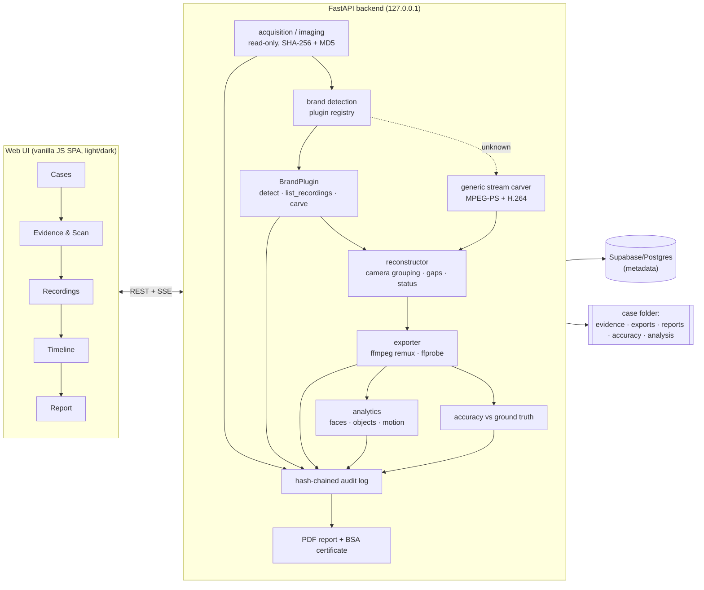

<div align="center">

# 🛡️ AEGIS Forensic Suite (SIH26150)

### Air-gapped Evidence Gathering & Integrity Suite
**Universal Offline DVR/NVR Surveillance Evidence Acquisition, Carving, Verification & Reporting**

[](https://github.com/BhanuPrasad-2006/sih-26150/releases/tag/v1.0.1)
[](docs/SYSTEM_ARCHITECTURE.md)
[](https://www.sih.gov.in/)
[](#-problem-statement-checklist)
[](https://ntro.gov.in/)

[](https://www.python.org/)
[](https://fastapi.tiangolo.com/)
[](https://opencv.org/)
[](https://ffmpeg.org/)
[](#-how-we-check-that-it-works)
[-darkblue)](docs/SECURITY.md)

[**Download Installer (v1.0.1)**](https://github.com/BhanuPrasad-2006/sih-26150/releases/download/v1.0.1/SIH_Forensic_Tool_Setup_v1.0.1.exe) · [**Live Web Portal**](https://bhanuprasad-2006.github.io/sih-26150/) · [**Architecture**](docs/SYSTEM_ARCHITECTURE.md) · [**SOP**](docs/SOP.md)

</div>

---

> [!IMPORTANT]
> **Honest status.** Everything in this project has been tested against disk images **we generated ourselves** (from public
> specifications and real, ffmpeg-encoded video), never against a physical recorder disk. Two OEM formats are implemented from
> published sources (Dahua, Hikvision), one from a single research paper (Honeywell), one by assumption (CP Plus), and four have
> **no vendor-specific support** (TP-Link, Godrej, Uniview, Matrix). Every recovered video is labelled `UNCERTAIN` or `PARTIAL`, never
> `COMPLETE`, unless independently verified. The tool never states a recovery percentage without ground truth.
> Details: [Format Admission Gate](docs/format_verification.md) · [OEM comparison](docs/oem_comparison.md).

---

## 📑 Contents

[The problem](#-the-problem) · [What it does](#-what-it-does) · [Architecture](#-architecture) · [OEM support](#-oem-support--what-is-really-implemented) ·
[Recovery pipeline](#-recovery-pipeline) · [Proving it works](#-how-we-check-that-it-works) · [Analytics](#-analytics) ·
[Quick start](#-quick-start) · [Using the tool](#-using-the-tool) · [API](#-api-overview) · [Security](#-security) ·
[Documentation](#-documentation) · [Repository map](#-repository-map) · [Problem-statement checklist](#-problem-statement-checklist) · [Limitations](#-known-limitations) · [Roadmap](#-roadmap)

---

## 🎯 The problem

DVR/NVR recorders from Dahua, Hikvision, CP Plus, Honeywell, TP-Link, Godrej, Uniview, Matrix and others each use their own
disk layout, index and frame container. Standard forensic tools see an unformatted disk. Investigators end up juggling vendor
tools, with inconsistent results, unclear timestamps, weak deleted-footage recovery and a fragile chain of custody.

This project is a **vendor-agnostic platform**: one workflow, pluggable per-vendor parsers, a generic standards-based fallback
for unknown recorders, and forensic bookkeeping (hashes, audit chain, report, legal certificate) that is the same for all of them.

## ✨ What it does

| | Capability | State |
|---|---|---|
| 🧲 | **Acquisition**: 15 formats supported (`.dd`, `.img`, `.raw`, `.bin`, `.001`, `.iso`, `.vmdk`, `.vhd`, `.vhdx`, `.e01`, `.ex01`, `.aff`, `.aff4`, `.qcow2`, extensionless raw); **native Windows file picker**; zero-copy memory mapping (`mmap ACCESS_READ`); drive imaging with write-blocker attestation | ✅ 15 image formats supported · physical drive untested |
| 🔐 | **Integrity**: SHA-256 + MD5 in one streaming pass (450+ MB/s benchmarked), re-hash after every scan, re-verify on demand | ✅ |
| 🧭 | **Brand identification**: signature scoring across 8 OEM plugins; unknown disks fall back to generic carving | ✅ signatures from public sources |
| 🧩 | **Parsing & carving**: Dahua DHFS 4.1 index + DHAV frames, Hikvision HIKBTREE index + H.264/PS blocks, Honeywell records, generic MPEG-PS/H.264 | ✅ synthetic disks · ⚠️ no real disks |
| ♻️ | **Deleted footage**: carves regions the index no longer lists (e.g. after initialisation) | ✅ synthetic |
| 🎞️ | **Export & playback**: lossless FFmpeg stream copy to MP4, `ffprobe` decode validation, and **play the exported video inside the app** | ✅ |
| 🕒 | **Timeline & correlation**: per-camera timeline, cross-camera events, examiner-set clock offset to UTC | ✅ |
| 🙂 | **Face detection & search**: YuNet detector + SFace embeddings, reference-photo search | ✅ |
| 🧍 | **Object detection**: YOLOX (80 COCO classes) via `cv2.dnn` with a classical fallback | ✅ 3 real photos · ⚠️ no CCTV data |
| 🌀 | **Motion detection**: frame differencing, labelled as *basic*, never as AI | ✅ |
| 🧪 | **Validation kit**: one command turns a real recorder's disk images + the exported clip into a finished validation report (verdict, recall/precision/order, byte placement, evidence hashes) | ✅ tested on generated disks · ready for real ones |
| 📏 | **Accuracy against ground truth**: frame recall / precision / order, byte placement, log coverage | ✅ new, honest "not measured" otherwise |
| ⛓️ | **Hash-chained audit log** of every action, tamper-evident | ✅ |
| 📄 | **PDF report** + **BSA 2023 §63(4)** certificate template, with examiner-entered police station, FIR, seizure officer and recorder details (printed as entered, marked unverified, blanks listed) | ✅ |
| 🔑 | **100% Offline Local Authentication**: completely isolated per-machine user profiles stored in local SQLite (`auth.db`), independent credentials, bcrypt hashing, brute-force lockout, 7-day remember tokens | ✅ air-gapped · zero cloud dependency |
| 🩺 | **Pre-flight System Diagnostics**: CLI tool (`tools/system_diagnostics.py`) certifies workstation, ONNX models, databases, and dual-hashing speed | ✅ 17/17 checks passing |
| 🎨 | **Interface**: light and dark themes, native file picker bridge, drag-and-drop evidence upload, inline SVG icons, audit and case times in IST | ✅ |

## 🏗️ Architecture


```mermaid
flowchart LR
    subgraph UI["Web UI (vanilla JS SPA, light/dark)"]
        A1[Cases] --> A2[Evidence & Scan] --> A3[Recordings] --> A4[Timeline] --> A5[Report]
    end
    UI <-->|REST + SSE| API

    subgraph API["FastAPI backend (127.0.0.1)"]
        direction TB
        ACQ["acquisition / imaging<br/>read-only, SHA-256 + MD5"]
        DET["brand detection<br/>plugin registry"]
        PLG["BrandPlugin<br/>detect · list_recordings · carve"]
        GEN["generic stream carver<br/>MPEG-PS + H.264"]
        REC["reconstructor<br/>camera grouping · gaps · status"]
        EXP["exporter<br/>ffmpeg remux · ffprobe"]
        ANA["analytics<br/>faces · objects · motion"]
        ACC["accuracy vs ground truth"]
        AUD["hash-chained audit log"]
        REP["PDF report + BSA certificate"]
        ACQ --> DET --> PLG --> REC --> EXP --> ANA
        DET -.unknown.-> GEN --> REC
        EXP --> ACC
        ACQ & PLG & EXP & ANA & ACC --> AUD --> REP
    end

    API --> DB[("Supabase/Postgres<br/>(metadata)")]
    API --> FS[["case folder:<br/>evidence · exports · reports · accuracy · analysis"]]
```

**Plugin contract** (`backend/plugins/base.py`): `detect(image) → confidence`, `list_recordings(image)`,
`carve(image) → RawFrame[]`, plus a `display_name` that always states how trustworthy the parser is.

## 🏷️ OEM support: what is really implemented

| OEM | What exists | Source of the format | Validated on real hardware |
|---|---|---|---|
| **Dahua** | DHFS 4.1 index (partition table, descriptors, cluster chains) + DHAV frame carving | Wullen 2025 spec, independent Batista extractor, FFmpeg `dhav.c` | ❌ |
| **Hikvision** | Master sector (found even when the file system is shifted), HIKBTREE index read through its page list (camera + time window per 1 GB block), H.264/PS carving, unindexed-block carving | Han, Jeong & Lee 2015 (ICDF2C), **cross-checked against a third party's published parse of a real 1 TB disk** | ❌ our code has not read a real image |
| **Honeywell** | GPT + 20-byte record headers + Annex B carving with real timestamps | Yoon & Hwang, arXiv:2605.07430 (one model) | ❌ |
| **CP Plus** | Detection, then carves through the Dahua engine, tagged as unverified | Dahua-compatibility *assumption* only | ❌ |
| **TP-Link · Godrej · Uniview · Matrix** | Weak name-hint detection; **no parser**. Disks go to generic carving | No public documentation found (searched Sep 2026) | ❌ |
| **Any other** | Generic standards-based MPEG-PS / H.264 Annex B carving | ISO/IEC 13818-1, H.264 | ❌ |

We refuse to guess offsets for undocumented vendors: an invented format would produce confident-looking wrong evidence.
The rules for promoting a format are in the [Format Admission Gate](docs/format_verification.md) (trust levels L0–L3; **nothing is L3 yet**).
Format sheets: [Dahua](docs/format_sheets/dahua.md) · [Hikvision](docs/format_sheets/hikvision.md) · [Honeywell](docs/format_sheets/honeywell.md).

## 🔬 Recovery pipeline

1. **Acquire**: open the image read-only (`mmap ACCESS_READ`); hash once.
2. **Identify**: every plugin scores the image; the best score above the threshold wins, otherwise the generic carver runs.
3. **Index** *(when the format has one)*: read the recorder's own index for camera numbers and times.
4. **Carve**: find frames or records by structure and validate each against a header checklist; skip clusters already accounted for by the index.
5. **Reconstruct**: group by camera and stream, split on real time gaps, never invent timestamps that a format does not carry.
6. **Export**: `ffmpeg -c copy` to MP4 (no re-encoding), then `ffprobe` decodes it.
7. **Label**: `UNCERTAIN` → `PARTIAL` only if the export decodes; `COMPLETE` is never assigned by carving alone.
8. **Re-verify**: re-hash the evidence and compare with the opening hash; log everything.

## ✅ How we check that it works

Because no real recorder disk was available, the tool is tested by building disks from the published specifications around
**real video** (ffmpeg-encoded H.264 containing a person) and checking what comes back:

| Check | Result |
|---|---|
| Dahua disk with DHAV frames: carve → export → decode → face detected → reference photo matches (and a different face is rejected) | ✅ |
| Same end-to-end run for Hikvision (MPEG-PS blocks, decoy streams, unindexed block) and Honeywell (record stream) | ✅ |
| Fragmented, interleaved Dahua recordings reassembled through the DHFS chain; index used for camera and time | ✅ |
| Parsers checked against **known-answer values printed in the papers/specs** | ✅ |
| Tamper test: change one byte of evidence → verification fails | ✅ |
| Accuracy feature on real video: identical, truncated, and different videos give the expected recall/precision/order | ✅ |
| **Automated suite** | **367 tests** (359 pass on a fresh clone; the other 8 need a live Supabase `DATABASE_URL`); GitHub Actions also runs `pip-audit` and `bandit` |

**A defect the accuracy check found:** on a synthetic Dahua disk with its index wiped, the carver found only 21 of 40 frames (byte recall 86.5 %).
The cause was a minimum frame size (100 bytes) that rejected tiny P-frames of a quiet camera; at 40 bytes it finds all 40 (byte recall 92.1 %,
placement precision 100 %). This is exactly the kind of loss that only comparison against ground truth exposes.

### 📏 Where does "93 % recovered" come from?

Nowhere, unless you provide ground truth. Without an original there is nothing to compare against, so the tool says
**NOT MEASURED** (in the UI and the PDF). With ground truth (Recordings → *Accuracy Against Ground Truth*):

| You supply | You get |
|---|---|
| A known-good video (e.g. exported by the recorder before deletion) | Frames recovered · frames that are right · frames in correct order · byte-identical yes/no |
| A recording log (JSON) | Time coverage and start/end offsets per logged recording |
| The original disk image from before the deletion | Original bytes recovered · bytes from the right place (against the DHFS index for Dahua; against our carver on the original for other formats, clearly labelled) |

Full method and limits: [docs/accuracy_measurement.md](docs/accuracy_measurement.md).
Without ground truth (the usual casework), the tool reports only what it can prove: does the video decode, are timestamps continuous,
where on the disk did each byte come from, and is the evidence hash unchanged.

## 🧠 Analytics

| Module | Engine | Notes |
|---|---|---|
| Face detection | OpenCV **YuNet** (CNN) | Detection only, no identity claim |
| Face search | **SFace** embeddings | Similarity *candidates for human review*, never confirmed matches |
| Object detection | **YOLOX** (COCO, 80 classes) via `cv2.dnn`; classical HOG person detector if the model file is removed | On 3 real photos: person 0.93, cat 0.94, cup/spoon/table found; a cup fell below threshold after compression (it can miss). HOG on the same person photo returned a wrong-place box |
| Motion | Frame differencing | Labelled *Basic Motion Detection*, never "AI" |

All analytics run on the **exported copy**, read-only, and never change the evidence, its hash, or the carving result.

## 🚀 Quick start

### 💾 Option A: Windows Desktop Installer (v1.0.1) — Recommended

For Windows 10/11 x64 workstations, download and run the standalone, air-gapped setup wizard:

* **Direct Download:** [SIH_Forensic_Tool_Setup_v1.0.1.exe](https://github.com/BhanuPrasad-2006/sih-26150/releases/download/v1.0.1/SIH_Forensic_Tool_Setup_v1.0.1.exe)
* **Release Page:** [GitHub Releases v1.0.1](https://github.com/BhanuPrasad-2006/sih-26150/releases/tag/v1.0.1)
* **Release Artifact:** `SIH_Forensic_Tool_Setup_v1.0.1.exe` (~100 MB)
* **SHA-256 Checksum:** `AA09FF9B5AB39B53BFE9627C856B06D7E59E52F85D05164EA3F36F9A057B7796`

Verify the installer checksum in PowerShell before running:
```powershell
Get-FileHash -Algorithm SHA256 .\SIH_Forensic_Tool_Setup_v1.0.1.exe
```

Or install via PowerShell automated one-liner:
```powershell
irm https://raw.githubusercontent.com/BhanuPrasad-2006/sih-26150/main/install.ps1 | iex
```

---

### 💻 Option B: Run from Source

**Requirements:** Python 3.11+, FFmpeg + ffprobe on `PATH`, Windows / Linux / macOS.

```cmd
:: Windows
install.bat
run.bat
```

```bash
# Linux / macOS
chmod +x install.sh run.sh
./install.sh && ./run.sh
```

`install.bat` also adds an **"AEGIS Forensic Tool" shortcut to your Desktop** — after the first install, just double-click
it. Either way, `run.bat` / `run.sh` open your browser to **http://127.0.0.1:8000** automatically once the server is
ready (like Jupyter Notebook does); it also runs entirely **locally, like Wireshark or Autopsy** — nothing is uploaded
anywhere unless you configure a remote database yourself. On first run you create your isolated local examiner credentials.

---

### 🩺 Pre-Flight System Certification & Diagnostics

Certify workstation health, database isolation, ONNX model weights, and evidence hashing throughput prior to active casework:

```bash
# Run interactive diagnostic report
python tools/system_diagnostics.py

# Output machine-readable JSON summary
python tools/system_diagnostics.py --json

# Run high-throughput crypto stress test (128 MB buffer)
python tools/system_diagnostics.py --benchmark-mb 128
```

The diagnostics tool verifies 17 critical subsystems including:
1. **OS & Python Environment:** Python 3.11+, 64-bit architecture, workspace write access.
2. **Local Auth & Case Databases:** `auth.db` (local SQLite user profile) and `forensic.db` integrity.
3. **Storage & BitLocker Protection:** Available case volume margin and hardware/OS volume encryption.
4. **Multimedia Transcoding:** FFmpeg and FFprobe binary health and codec availability.
5. **Computer Vision Inference:** Pinned SHA-256 validation for YuNet, SFace, and YOLOX ONNX models.
6. **Crypto & Dual-Hashing Performance:** Benchmark measuring dual SHA-256 + MD5 throughput (>450 MB/s).
7. **Forensic Format Parsers:** 15 supported raw & virtual image extensions and 8 registered OEM plugins.

<details>
<summary><b>Optional settings</b></summary>

| Variable | Purpose |
|---|---|
| `SUPABASE_URL` | Supabase project URL (desktop installer — baked in at build time via `packaging/bundle_env.py`) |
| `SUPABASE_ANON_KEY` | Supabase anon/public key — client-safe, protected by RLS (desktop installer) |
| `DATABASE_URL` | Postgres direct connection string (developer/server use; never bundled in installer) |
| `FORENSIC_CASE_DIR` | Where cases, exports and reports are stored |
| `FORENSIC_ALLOW_LOCAL_ACQUISITION=1` | Enables **drive imaging** (reads drives attached to this machine; keep off on any shared server) |
| `OBJECT_MODEL_PATH` | Use a different YOLOX ONNX model |
| `SESSION_TIMEOUT_MINUTES` | Idle timeout (default 30) |
| `FORENSIC_EVIDENCE_ROOTS` | Folders the server may read evidence / original-image / imaging-source paths from (path-separator list). Unset = any local path (single-user workstation) |
| `SIH_ALLOWED_HOSTS` | Extra Host names accepted besides localhost / 127.0.0.1 |
| `SIH_KEY_DIR` | Folder for the audit-seal, data-encryption and report-signing keys (default `~/.sih_forensic/`); keep it off the database machine and back it up |
| `SIH_AUDIT_KEY`, `SIH_DATA_KEY`, `SIH_REPORT_SIGNING_KEY` | Supply those keys from the environment instead of files |
| `SIH_MAX_UPLOAD_GB` | Upload size cap (default 200) |
| `SIH_TLS=1`, `SIH_TLS_CERT`, `SIH_TLS_KEY` | Serve HTTPS (self-signed localhost certificate unless you supply your own) |
| `SESSION_MAX_HOURS` | Absolute session lifetime (default 12) |
| `SIH_HOST` | Warns if set to anything other than localhost |

</details>

## 🖱️ Using the tool

1. **Create a case** (case number, examiner, notes).
2. **Add disk image** (three ways, one window): **drag and drop** a file onto the upload area or browse for it; give the **path** of a file already on this machine (best for multi-GB images); or **image a drive** (requires the setting above and your write-blocker confirmation). The window shows the file name and size before you start, and a progress bar while it uploads.
3. **Scan**: hashes → brand detection → index → carving → reconstruction → final re-hash, with live progress. When it finishes you stay on the page and press **View recordings**; nothing redirects on its own. The file type shown comes from the file itself, and brands that are unverified or detection-only get an amber badge.
4. **Recordings**: review segments, export MP4 and **Play** it in the app, run faces / objects / motion, search a person by photo.
5. **Accuracy** *(test scenarios)*: compare a segment with ground truth.
6. **Timeline**: per-camera timeline and cross-camera correlation.
7. **Report**: fill in the **Certificate details** (police station, FIR, seizure officer, recorder make/model/serial; optional, saved per case), then generate the PDF with hashes, segments, correlation, accuracy, object detection, audit chain and the BSA §63(4) certificate.

**Interface notes**

- **Theme:** follows your system's light/dark setting; the sun/moon button in the header switches it (remembered in that browser only).
- **Times:** case-created and audit-log times are shown in **IST**. Times of recovered video are shown as **Recorder time**, exactly as read from the recorder, because they carry no time zone; enter the device clock offset when adding the image if you want cross-device correlation.
- **Colours:** green = complete, amber = partial or unverified, orange = uncertain, red = error.

Step-by-step procedure: [docs/SOP.md](docs/SOP.md).

## 🔌 API overview

All routes except login/setup require the session cookie. Interactive docs at `/api/docs`.

| Area | Endpoints |
|---|---|
| Cases & evidence | `POST/GET /api/cases` · `POST /api/cases/{id}/evidence` · `…/evidence/upload` · `GET …/verify` |
| Imaging | `GET /api/acquisition/drives` · `POST …/acquire` · `GET …/acquire/status` |
| Scan | `POST …/scan` · `GET …/status` (SSE) · `GET …/segments` |
| Export & analytics | `POST …/export/{seg}` · `GET …/video/{seg}` (plays the exported MP4; range requests) · `…/motion/{seg}` · `…/face-detect/{seg}` · `…/object-detect/{seg}` · `POST …/face-search` |
| Analysis | `GET …/timeline` · `GET …/correlation` · `POST/GET …/accuracy` |
| Output | `GET/PUT …/certificate` (details printed on the §63(4) pages) · `GET …/report` · `GET …/audit` |

## 🔒 Security

<details>
<summary><b>Access control, integrity and audit design</b></summary>

- **Local only**: binds to `127.0.0.1`; a loud warning is emitted if `SIH_HOST` says otherwise.
- **Named examiner accounts**: each has their own bcrypt-hashed password (minimum 8 characters, with an uppercase letter, a lowercase letter, a digit and a special character) — the plaintext is never stored or logged. There are no separate permission levels: any signed-in examiner can see every case, but every action is attributed to the account that did it. A forgotten password has no in-app recovery (no email/SMS on an offline tool) — `tools/reset_user_password.py` resets it from a terminal with access to the machine.
- **Sessions**: `HttpOnly`, `SameSite=Strict` cookie; 30-minute idle timeout (configurable).
- **Brute-force lockout**: 5 failures on one account → 60 s lock with live countdown, never affecting other accounts; the count and lock time are stored in the database, so restarting the server does not reset them; messages never reveal whether a username exists or which field was wrong.
- **Read-only evidence**: images are memory-mapped read-only; the evidence hash is re-checked after every scan and on demand.
- **Imaging** is off by default, requires a write-blocker attestation (recorded, not enforceable by software), refuses to overwrite, and removes a partial image on failure.
- **Two-factor login (optional TOTP)** with **one-time recovery codes**: RFC 6238 codes (tested against the RFC vectors), single-use, encrypted secret, uniform errors; every other session ends when it changes. Turn it on from the dashboard.
- **Sessions**: 30-minute idle timeout plus a 12-hour absolute lifetime.
- **Optional HTTPS** (`SIH_TLS=1`): local self-signed certificate, `Secure` cookie, HSTS.
- **Request hardening**: security headers on every response; **strict CSP with no inline script** (enforced by a test); Host header must be a local name (DNS-rebinding defence); cross-origin state-changing requests refused; API docs and schema need a session; upload cap; optional path allow-list.
- **Output escaping**: every server- or user-supplied string is HTML-escaped before it reaches the page.
- **Hostile input**: every disk parser is **mutation-fuzzed** (4,000+ corrupted images, no crash, hang or memory blow-up); `ffmpeg`/`ffprobe` run **sandboxed** (timeout kill, memory cap, no child processes on Windows, scrubbed environment, local-files-only protocol whitelist). A hardened **container profile** (`Dockerfile`, `docker-compose.yml`) is provided; it is untested here.
- **Signed reports**: each PDF carries an **embedded signature** (viewers show it) and a **detached Ed25519 signature**; the SHA-256 is in the audit chain; verify via the API or `python -m backend.report_signing verify`.
- **Encryption**: face embeddings and the 2FA secret are AES-encrypted in the database; case hand-over uses a passphrase-encrypted **case package** (AES-256-GCM, scrypt, tamper-evident chunks).
- **Model integrity**: the three ONNX models are SHA-256-pinned; a changed file is refused.
- **Supply chain and code**: `requirements.lock.txt`; `pip-audit` (including transitive dependencies) and `bandit` clean; a GitHub Actions workflow runs tests, pip-audit and bandit on every push and weekly.
- **Keyed audit seal** for every case log **and** the login log: the chain head and count are HMAC-sealed with a key outside the database, so truncation or a full database rewrite is detected; the head hash is printed in the report.
- **Security self-check** (`GET /api/security/status`, after login): 2FA, HTTPS, network exposure, key files, disk encryption, seals, model integrity.
- **Hash-chained audit log**: every action (including login attempts, never the password) is chained:

$$\text{Hash}_n = \text{SHA-256}(\text{Timestamp}_n \parallel \text{Action}_n \parallel \text{Params}_n \parallel \text{Hash}_{n-1})$$

  Editing any past entry breaks every later hash.
- **Scope**: single-user access control, no roles or multi-user attribution. Multi-examiner or enterprise use would need a different design.
- **Full detail, key management, limits and a deployment checklist: [docs/SECURITY.md](docs/SECURITY.md).** High security here means hardened and tested, not unhackable: evidence files are not encrypted by the application (use disk encryption), the container profile is untested, and no independent penetration test has been done.

</details>

**Legal context:** the certificate follows the structure of **Bharatiya Sakshya Adhiniyam 2023, Section 63(4)** (formerly IEA §65B); Part A is filled
in automatically with system parameters and hashes. Practice is aligned with **ISO/IEC 27037**. This is a template to support an examiner, not legal advice.

## 📚 Documentation

| Document | What it is |
|---|---|
| [Validation Kit](docs/VALIDATION_KIT.md) (download page: `docs/index.html`, published with GitHub Pages) | How anyone with a real recorder can produce a validation report in about an hour |
| [Security](docs/SECURITY.md) | Threat model, every control, key management, residual risks, deployment checklist |
| [System Architecture](docs/SYSTEM_ARCHITECTURE.md) | Components, data model, scan sequence, security design, extension points |
| [User Manual](docs/USER_MANUAL.md) | Every screen, result and label explained; troubleshooting |
| [SOP](docs/SOP.md) | Step-by-step procedure for a live case |
| [Validation Report](docs/VALIDATION_REPORT.md) | What was verified, what was not, defects found, and the protocol for real-recorder validation |
| [Final Project Report](docs/FINAL_PROJECT_REPORT.md) | Abstract, method, results, OEM comparison, limitations, traceability |
| [OEM Comparison](docs/oem_comparison.md) · [Format Admission Gate](docs/format_verification.md) · [Accuracy Measurement](docs/accuracy_measurement.md) · [Format sheets](docs/format_sheets/) | Evidence basis for each vendor and how accuracy is measured |

## 🗂️ Repository map

```
sih-26150/
├── backend/
│   ├── main.py               FastAPI app, auth middleware, scan orchestration, all endpoints
│   ├── acquisition.py        read-only image open + dual hashing        imaging.py   drive → .dd imaging
│   ├── reconstructor.py      camera/stream grouping, gaps, status       exporter.py  ffmpeg remux + ffprobe
│   ├── accuracy.py           ground-truth comparison                    audit.py     hash-chained log
│   ├── face_detection.py · face_search.py · object_detection.py · motion.py   analytics
│   ├── timeline.py · correlation.py · reporting.py · database.py · db_postgres.py · auth.py
│   ├── cv_models/            YuNet, SFace, YOLOX (ONNX)
│   ├── plugins/              dahua · dahua_dhfs · hikvision · hikvision_index · honeywell · cpplus
│   │                         tplink · godrej · uniview · matrix · unknown · generic · stream_carver · registry
│   └── tests/                367 automated tests (+ manual real-video end-to-end scripts)
├── docs/                     SOP · format_verification · oem_comparison · accuracy_measurement · format_sheets/
├── frontend/                 vanilla HTML/CSS/JS single-page app (no build step); css/style.css design system, js/icons.js icon set
├── install.* / run.*         one-click setup and launch
└── requirements.txt
```

≈ 18,500 lines of Python including tools (≈ 6,600 of them tests) and ≈ 4,300 lines of front-end code.

## 📋 Problem-statement checklist

| Requirement (SIH26150) | Status |
|---|---|
| Automatic DVR/NVR model identification | 🟡 signature-based brand identification, not model identification |
| Forensic imaging / acquisition | 🟡 built; file path tested, **physical drive path untested**, write blocker is an attestation |
| Parse proprietary file systems | 🟡 Dahua DHFS 4.1 and Hikvision HIKBTREE implemented from public sources; not validated on real disks |
| Decode proprietary video formats | 🟡 DHAV, Hikvision PS/H.264, Honeywell records; four OEMs have none |
| Recover deleted footage | 🟡 works on synthetic disks; unknown on real ones |
| MD5 + SHA-256 hashing, chain of custody | ✅ |
| Normalise timestamps | 🟡 examiner-set UTC offset; no automatic clock-drift correction |
| Correlate events across cameras | ✅ time-window correlation |
| Face / object / motion analytics | ✅ |
| Reports | ✅ PDF + BSA §63(4) certificate |
| ≥ 5–6 OEMs | ❌ honestly **2 from public sources + 1 from one paper** (+ CP Plus by assumption) |
| Comparative OEM analysis | ✅ [docs/oem_comparison.md](docs/oem_comparison.md) (public sources only) |
| SOP | ✅ [docs/SOP.md](docs/SOP.md) |
| Validation report, user manual, architecture document, final report | ✅ written ([docs](#-documentation)); the validation report states honestly that only synthetic disks were used |
| A real DVR/NVR forensic image | ❌ none available |

Legend: ✅ done · 🟡 partly / unvalidated · ❌ not done.

## ⚠️ Known limitations

1. **No real-disk validation.** All disks were generated by us from public specifications; format offsets may be wrong on real devices.
2. **Four OEMs have no vendor support** (TP-Link, Godrej, Uniview, Matrix) because no public documentation exists. Generic carving works only if a recorder stores standard streams.
3. **Honeywell** rests on one paper about one device model. **CP Plus** rests on an unverified Dahua-compatibility assumption.
4. **Hikvision** per-frame timestamps are unavailable (the record layout is unpublished); only block-level time windows exist.
5. **Recovery is never "complete"** by carving; labels stay `UNCERTAIN`/`PARTIAL` without independent verification.
6. **Drive imaging** has not been run on a physical disk; raw devices need administrator rights; software cannot enforce write-blocking.
7. **Object detection** was checked on three photos, not on CCTV footage; small, dark or distant subjects will be missed. Frames are sampled.
8. **Accuracy numbers** describe one test on one disk and are not a general recovery rate.
9. Clock drift and time zones are examiner-supplied, never inferred. Recovered-video times are the recorder's own clock and are not converted to IST or UTC by the interface.
10. Bound to localhost, not internet-facing. Multiple named examiner accounts can sign in, but there are no per-account permission levels — any signed-in examiner sees every case.

## 🗺️ Roadmap

1. Run the [validation kit](docs/VALIDATION_KIT.md) on real recorder disks (a friend's DVR, a shop's retired disk, or an NTRO lab) and promote formats through the admission gate.
2. Validate drive imaging on a scratch disk behind a write blocker.
3. Fill in the validation results table with real-recorder runs ([protocol](docs/VALIDATION_REPORT.md)).
4. Vendor formats for TP-Link, Uniview, Godrej, Matrix once a public source or sample disk exists; confirm CP Plus.
5. Evaluate object/face analytics on real surveillance footage.

## 📚 Sources

- J. Han, D. Jeong, S. Lee, *Analysis of the HIKVISION DVR File System*, ICDF2C 2015 (LNICST 157)
- D. Wullen, *Forensic analysis of the filesystem Dahua DHFS 4.1* (2025), and the Batista open-source extractor
- J. Yoon & S. Hwang, *Forensic analysis of video data deletion and recovery in Honeywell surveillance file system*, arXiv:2605.07430
- FFmpeg `libavformat/dhav.c` (DHAV frame structure)
- OpenCV model zoo: YuNet, SFace, YOLOX (Apache-2.0)
- ISO/IEC 13818-1 (MPEG-PS), ITU-T H.264 Annex B

---

<div align="center">

**Built for Smart India Hackathon 2026 · SIH26150 · National Technical Research Organisation (NTRO)**
*Findings are only as strong as their validation, and this project says exactly how strong that is.*

</div>
