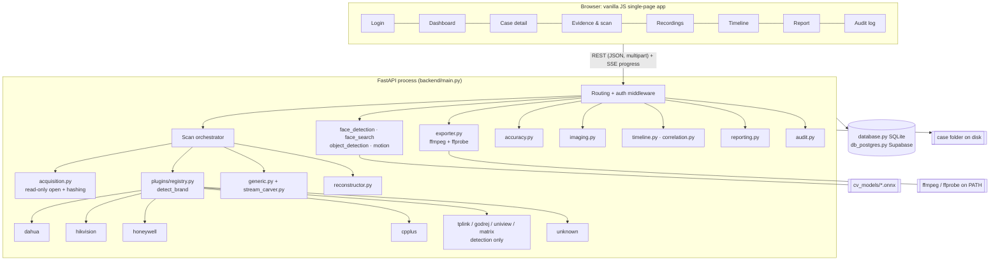
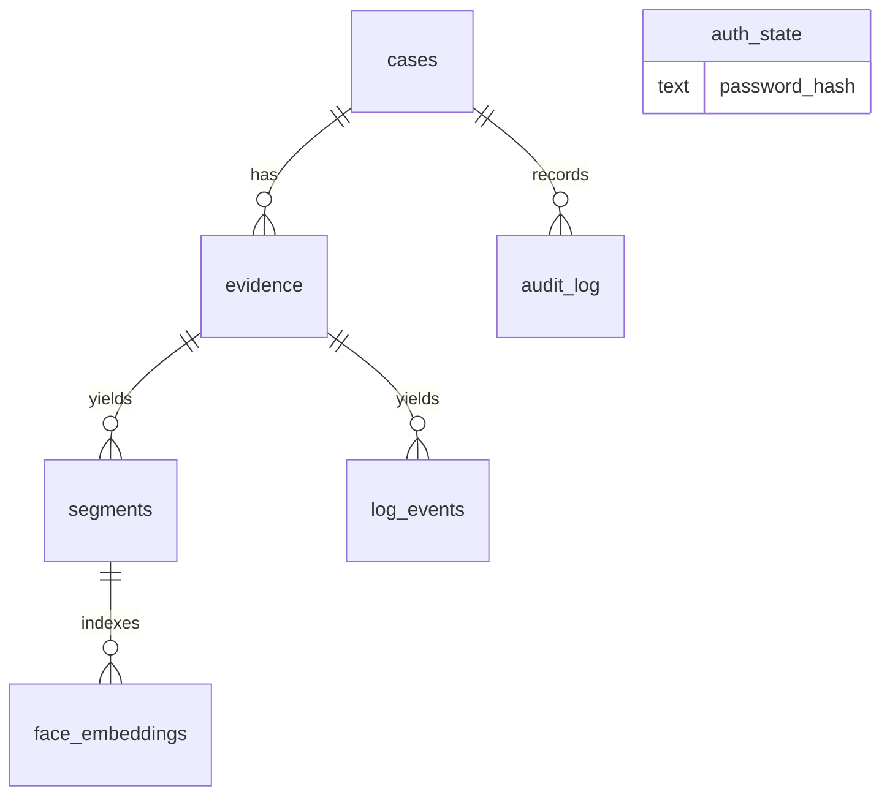
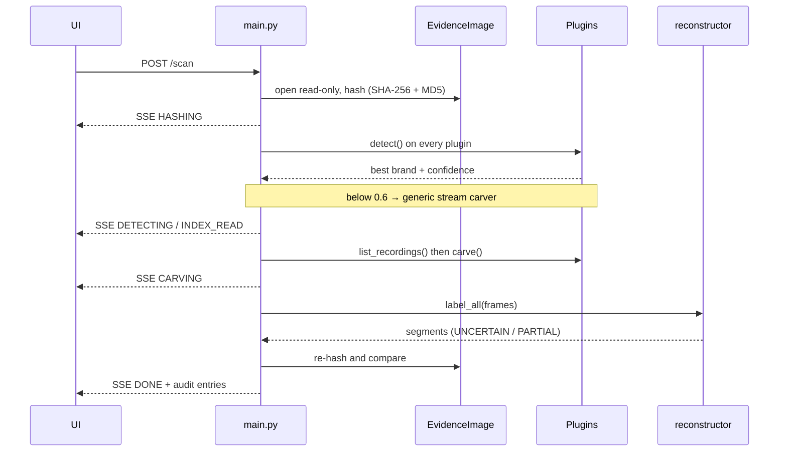

# System Architecture

SIH26150 · Multi-Vendor DVR/NVR Forensic Analysis Tool · describes the code as built (branch `main`).

## 1. Goals and constraints

| Goal | How the design serves it |
|---|---|
| One workflow for many vendors | A `BrandPlugin` interface; everything after carving (reconstruction, export, analytics, reporting) is vendor-neutral |
| Never alter evidence | Images are opened read-only (`mmap ACCESS_READ`); the evidence hash is taken first and re-checked after every scan and on demand |
| Never over-claim | Recovery labels are `UNCERTAIN` / `PARTIAL` only; `COMPLETE` is never assigned by carving. Percentages exist only against supplied ground truth |
| Court-usable record | Hash-chained audit log, PDF report, BSA 2023 §63(4) certificate template |
| Runs on an examiner's workstation | Single process, localhost, SQLite by default, no build step for the UI |

Non-goals: multi-user/role-based access, live acquisition from a running recorder, cloud processing of evidence.

## 2. Component view



## 3. Backend modules

| Module | Responsibility |
|---|---|
| `main.py` | Endpoints, session-cookie middleware, scan orchestration (`_run_scan`), progress via SSE, report assembly |
| `acquisition.py` | `EvidenceImage`: refuses physical-device paths, opens the file read-only, one-pass SHA-256 + MD5, `verify_unchanged` |
| `imaging.py` | Creates an image from a file or raw device: hashes the bytes written, zero-fills and lists unreadable sectors, re-hashes the result, optional source re-hash, sidecar `.acquisition.json` |
| `plugins/base.py` | `BrandPlugin`: `detect(img) → 0..1`, `list_recordings(img)`, `carve(img)`, `version_hint`, `display_name` |
| `plugins/registry.py` | Ordered plugin list; `detect_brand` picks the highest confidence at or above `MIN_PLUGIN_CONFIDENCE` (0.6) |
| `plugins/dahua.py`, `dahua_dhfs.py` | DHAV frame carving and validation; DHFS 4.1 index reader (partition table, descriptors, chains) |
| `plugins/hikvision.py`, `hikvision_index.py` | Master-sector parsing and consistency checks, HIKBTREE entry scan, per-block carving with camera/time window |
| `plugins/honeywell.py` | GPT partition lookup, 20-byte record chain validation, Annex B extraction |
| `plugins/cpplus.py` | Detection, then delegates to the Dahua engine and tags frames `cpplus` |
| `plugins/tplink.py`, `godrej.py`, `uniview.py`, `matrix.py` | Weak vendor-string hint only; `carve` returns nothing |
| `plugins/generic.py`, `stream_carver.py` | Standards-based fallback: MPEG-PS packs and H.264 Annex B (SPS→PPS→slice), region-limited when an index provides regions |
| `plugins/constants.py` | Every magic value, offset and threshold, each tagged with its evidence basis |
| `reconstructor.py` | Group by camera and stream; split on adaptive time gaps; assign status and human-readable notes per brand |
| `exporter.py` | ffmpeg stream-copy remux (`-f dhav`, `-f h264`, or PS auto-detect), `ffprobe` validation, file hash |
| `face_detection.py`, `face_search.py`, `object_detection.py`, `motion.py` | Read-only analytics on the exported MP4 |
| `accuracy.py` | Ground-truth comparison (see §7) |
| `timeline.py`, `correlation.py` | UTC normalisation with an examiner-set offset; cross-camera time-window clustering |
| `audit.py` | Hash-chained log: `H_n = SHA-256(t_n ∥ action_n ∥ params_n ∥ H_{n-1})` |
| `reporting.py` | ReportLab PDF: cover, hashes, segments, correlation, accuracy, object detection, method and limitations, audit dump, BSA §63(4) certificate |
| `auth.py` | bcrypt password, sessions, idle timeout, lockout |
| `database.py` / `db_postgres.py` | Same interface over SQLite (default) or Supabase Postgres (`DATABASE_URL`) |

## 4. Data model



Tables: `cases`, `evidence` (path, size, SHA-256/MD5 before, SHA-256 after, brand, confidence, device UTC offset), `segments`
(camera, times, frame count, status, notes, export path and hash, motion/face flags), `log_events`, `audit_log`, `face_embeddings`, `auth_state`.
Results that are not columns live beside the evidence in the case folder:

```
<FORENSIC_CASE_DIR>/<case_id>/
├── evidence/    uploaded or acquired images (+ .acquisition.json)
├── exports/     exported MP4 segments
├── reports/     generated PDFs
├── accuracy/    result_<id>.json     (ground-truth comparisons, ground-truth files)
└── analysis/    objects_<segment>.json
```

## 5. Scan sequence



The scan is an async background task whose blocking steps (hashing, detection, carving) run in worker threads; progress is pushed over Server-Sent Events.

## 6. Recovery design

- **Detection:** each plugin returns a confidence from on-disk signatures; nothing is decided by file name. Weak vendor strings are capped below the threshold on purpose.
- **Index-first, carve-second:** where a documented index exists (Dahua DHFS, Hikvision HIKBTREE) it supplies camera numbers and times, and carving covers the rest (unindexed blocks, deleted footage). Conflicts between a specification and a reference implementation are resolved conservatively and recorded in the format sheet.
- **Frame validation:** every candidate frame passes a checklist (magic, type, length bounds, timestamp plausibility, trailer where the format has one). Rejected candidates are not guessed at.
- **Reconstruction:** timestamps are never invented. Stream-carved brands without per-frame times are grouped by contiguity and stream identity, and their segments say so.
- **Trust levels:** L0 rumoured, L1 single source read, L2 corroborated and tested on synthetic data, L3 validated on a real recorder disk. Nothing is L3 (see `docs/format_verification.md`).

## 7. Accuracy and analytics design

`accuracy.py` compares one exported segment with supplied ground truth and stores the result per case: byte-identical check; frame recall, precision and order (exact `framemd5` or tolerant 8×8 average hash, longest-increasing-subsequence for order); time and camera coverage against a recording log; byte placement against the original disk's DHFS index or, for other formats, the same carver run on the original image (always labelled). No ground truth → "not measured".

Analytics read the exported MP4 only: YuNet (faces), SFace (embeddings, similarity candidates), YOLOX via `cv2.dnn` (objects, with a HOG person-detector fallback), and frame differencing (motion, labelled *basic*).

## 8. Security architecture

| Concern | Control |
|---|---|
| Network exposure | Binds to `127.0.0.1`; warns if `SIH_HOST` differs |
| Authentication | Single examiner, bcrypt hash, ≥ 12 characters |
| Sessions | `HttpOnly`, `SameSite=Strict` cookie; idle timeout 30 min (`SESSION_TIMEOUT_MINUTES`) |
| Brute force | 5 failures → 60 s lock (HTTP 429 with `retry_after`) |
| Evidence integrity | Read-only mmap; hash on open, re-hash at end of scan and on `/verify` |
| Path handling | Upload names sanitised; physical-device paths refused for scanning; imaging refuses device destinations and existing files; optional server-side allow-list (`FORENSIC_EVIDENCE_ROOTS`) for evidence, original-image and imaging-source paths, resolved through `..` and symlinks |
| Web hardening | `security.py`: CSP, `X-Frame-Options: DENY`, `nosniff`, no-referrer on every response; Host must be a local name; foreign `Origin` / cross-site fetches refused on POST/PUT/PATCH/DELETE; API docs and OpenAPI schema require a session |
| Output escaping | All server/user strings pass `escapeHtml()` before `innerHTML`; a test fails if known risky fields are interpolated raw |
| Model integrity | `model_integrity.py`: the three ONNX models are SHA-256 pinned; a mismatch disables the analytic |
| Supply chain | `requirements.lock.txt` (exact versions) and `pip-audit`; `starlette` and `python-multipart` were upgraded after audit findings |
| Drive imaging | Off unless `FORENSIC_ALLOW_LOCAL_ACQUISITION=1`; write-blocker attestation mandatory and logged |
| Repudiation | Hash-chained audit log for logins, evidence, scans, exports, analytics, accuracy checks, imaging, reports; `audit_seal.py` HMAC-seals the chain head and count with a key kept outside the database, so truncation or a full rewrite of the stored chain is detected, and the head hash is printed in the report |
| Secrets | `.env` git-ignored; tests force `DATABASE_URL=""` so they cannot touch a real database |

Residual risks: software cannot enforce write-blocking; the tool is not designed for multi-user or internet exposure; the audit log is tamper-evident, not tamper-proof (an attacker who holds the seal key and the case folder can forge the seal; a printed copy of the head hash in the report detects even that); the CSP still allows inline script because the UI uses inline handlers; reports are not digitally signed; case data and face embeddings are not encrypted at rest (use disk encryption); parsers have not been fuzz-tested and ffmpeg is not sandboxed.

## 9. Extension points

- **New vendor:** subclass `BrandPlugin`, add constants with evidence tags, register in `registry.py`, add a format sheet and known-answer tests, and pass the admission gate before claiming support.
- **New analytic:** operate on the exported file, store the result under `analysis/`, add an audit entry and a report section.
- **New store:** implement the `database.py` interface (Postgres was added this way).

## 10. Known architectural limits

Single process and single examiner; whole-image scans are sequential; carving works on a memory map so very large images depend on OS paging; performance has not been benchmarked on multi-terabyte disks.
